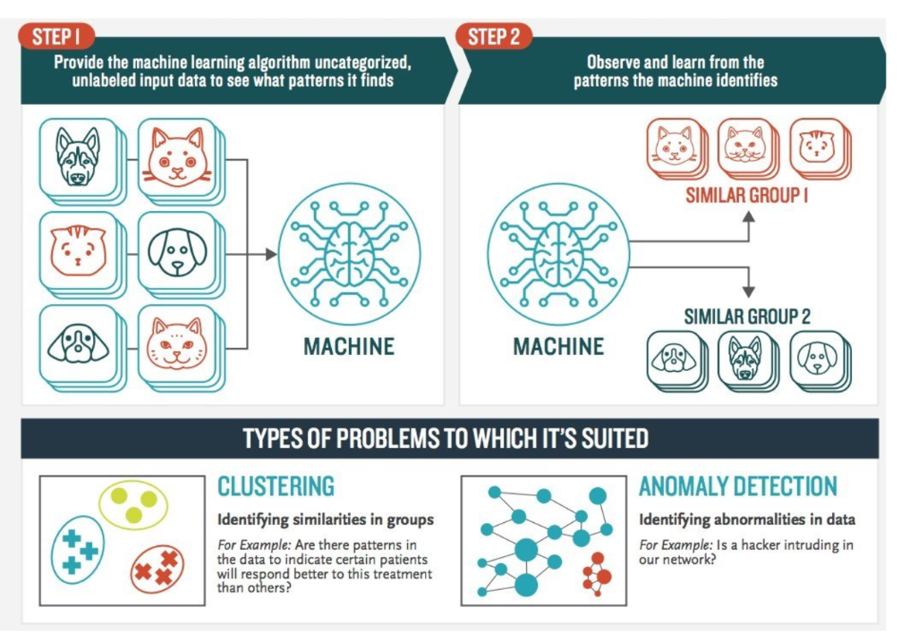
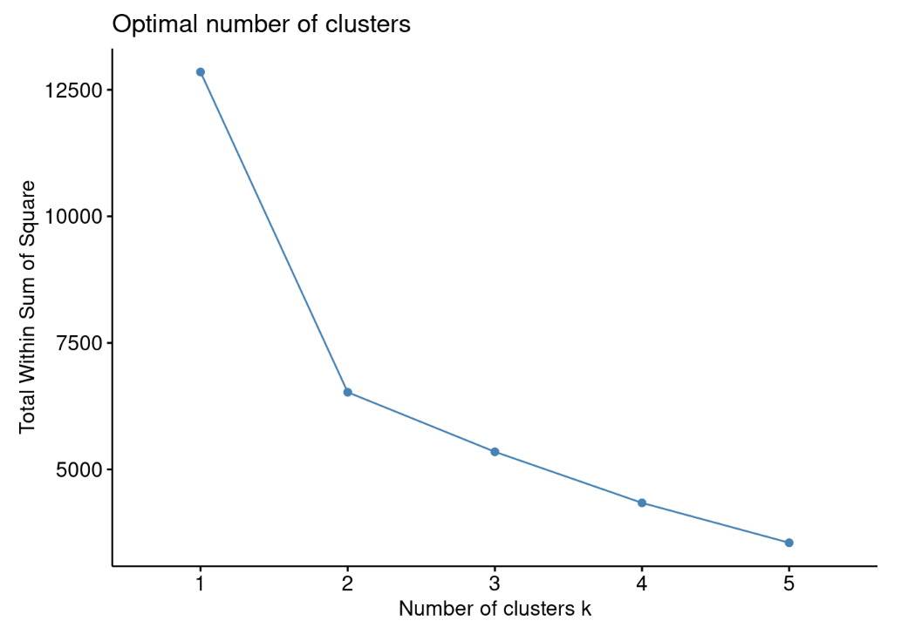
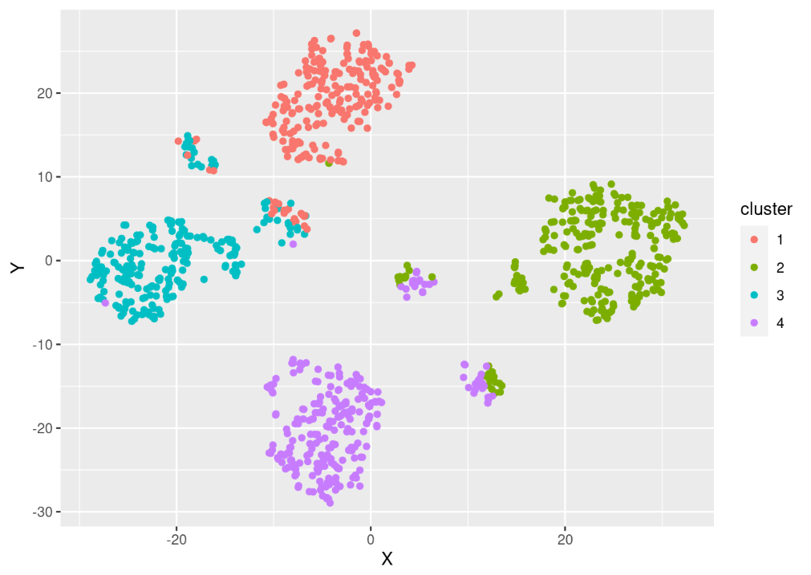

<style>
body {
text-align: justify}
</style>

```{r}
# clear-up the environment
rm(list = ls())

# chunk options
knitr::opts_chunk$set(
  message = FALSE,
  warning = FALSE,
  fig.align = "center",
  comment = "#>"
)

# scientific notation
options(scipen = 9999)
```

# Pendahuluan

Materi ini diproduksi oleh tim dari Algoritma untuk *DDE - Bank OCBC NISP *. Materi berikut hanya ditujukan untuk kalangan terbatas, meliputi individu/personal yang menerima materi ini secara langsung dari lembaga pelatihan. Materi ini dilarang untuk direproduksi, didistribusikan, diterjemahkan, atau diadaptasikan dalam bentuk apapun di luar izin dari individu dan organisasi yang berkepentingan.

**Algoritma** adalah pusat pendidikan Data Science di Jakarta. Kami mengadakan workshop dan program pelatihan untuk membantu para profesional dan pelajar untuk mendapatkan keahlian dalam berbagai bidang dalam ruang lingkup Data Science: data visualization, machine learning, data modeling, statistical inference, dan lain-lainnya.

Sebelum masuk ke dalam materi dan menjalankan kode-kode di dalam materi ini, silakan anda melihat bagian **Library and Setup** untuk melihat dan memastikan semua persyaratan dasar untuk mengikuti materi ini sudah terpenuhi termasuk package-package yang diperlukan. Pada bagian **Tujuan Pembelajaran** anda dapat melihat secara umum apa saja yang akan dipelajari dalam modul materi ini. Kami harap materi ini akan bermanfaat bagi karir ataupun menambah keahlian peserta.

## Tujuan Pembelajaran

Tujuan utama dari workshop ini adalah untuk memberikan pengenalan yang komprehensif mengenai tools dan perangkat lunak yakni sebuah open-source *R Programming* yang digunakan untuk melakukan sekementasi kustomer dengan menggunakan dari *Unsupervised Machine Learning - Clustering*. Adapun materi ini akan mencakup:

- Persiapan Data
  * Membaca Data
  * Memproses dan manipulasi data agar dapat dieksplorasi/Data Wrangling
- Eksplorasi Data
  * Eksplorasi data secara statistika deskriptif
  * Eksplorasi data secara visualisasi
- Unsupervised Machine Learning
  * Persiapan clustering
  * Clustering dengan K-Medoids
  * Interpretasi hasil clustering

# Topik bisnis: Customer Segmentation Based On Credit Card Usage Behaviour

Dengan berbagai macam fitur maupun promo yang ditawarkan kepada pengguna kartu kredit, banyak sekali individu yang mulai membuat kartu kredit untuk mempermudah proses transaksi yang dilakukan dan mendapatkan promo menarik.

Untuk dapat bersaing antara Bank dalam mengait calon pengguna kartu kredit, kita harus dapat menawarkan jenis kartu kredit yang sesuai dengan kebutuhan dari calon pelanggan kita. Selain mengait para pengguna baru, kita juga harus menjaga bahkan meningkatkan retensi pelanggan dengan cara memberikan promo yang lebih tepat sasaran.

Dalam melakukan kedua hal tersebut tidaklah mudah karena setiap pengguna kartu kredit memiliki karakteristik yang berbeda-beda. Walaupun berbeda-beda, setiap customer dapat dikelompokan dengan karakteristik yang mendekati satu dengan lainnya sehingga nantinya dapat beberapa kelompok yang memiliki karakteristik yang mendekati. Dengan mempelajari setiap karakteristik dari setiap kelompok, kita dapat menarik kesimpulan untuk menentukan strategi bisnis untuk meningkatkan pengguna baru dan meningkatkan kepuasan dari pengguna lama.

## Library 

```{r, message=FALSE, warning=FALSE}
# Data Wrangling
library(tidyverse)
library(Hmisc)

# Machine Learning - Clustering 
library(cluster)
library(factoextra)

# Visualization
library(Rtsne)
```

## Persiapan Data

### Membaca Dataset

Data yang kita gunakan adalah data behavior dari para pengguna kartu kredit disebuah bank. Data tersebut kami letakan di foder `data` dengan nama file `creditcard_customer_behavior.csv`, fungsi yang dapat dimanfaatkan untuk membaca data adalah `read.csv()``

Kita menyimpan data tersebut ke dalam sebuah object bernama retail menggunakan tanda assignment `(<-)`. Objek akan disimpan dalam environment R dan dapat diolah lebih lanjut.

```{r}
# Membaca data
customer <- 
read.csv("data/creditcard_customer_behavior.csv")
```

Setelah membaca datanya kita bisa hanya melihat beberapa data yang paing atas dengan menggunakan funsi `head()`.

```{r}
# Menampilkan 6 data paling atas 
head(customer)
```

Deskripsi singkat:

- `CLIENTNUM`: Unique ID Client
- `Customer_Age`: Umur customer
- `Gender`: gender customer
- `Education_Level`: Tingkat pendidikan
- `Marital_Status`: Status Pernikahan
- `Income_Category`: Range pendapatan
- `Months_Inactive_12_mon`: Selama 12 bulan terakhir sempat tidak menggunakan kartu kredit berapa lama
- `Credit_Limit`: Limmit dari creditcard
- `Total_Trans_Amt`: Jumlah amount transaksi yang dilakukan selama 12 bulan terakhir
- `Total_Trans_Ct`: Total transaksi yang dilakukan selama 12 bulan terakhir

*Additional Info:*

Kita dapat membaca berbagai macam tipe file data di R, berikut adalah beberapa contoh file yang dapat kita baca di R.

- .Rds: File dalam format R.
- .csv: File dalam format csv(comma seperated value).
- .xlsx: File dalam formal excel.

Selain membaca data yang sudah tersimpan dalam komputer kita, R Studio juga dapat kita sambungkan ke database untuk mengambil data-data yang tersimpan pada database tersebut.

### Data Wrangling

*Wrangling 1:* Apakah kolom `CLIENTNUM` perlu kita simpana atau tidak?

```{r}
head(customer)
```


- Opsi 1: Kolom `CLIENTNUM` dapat kita buang karena nantinya dapat mempengaruhi perhitungan dan pembuatan kelompok.

Untuk melakukan hal tersebut kita bisa menggunakan fungsi `select()` 

```{r}
# Menghilangkaan kolom CLIENTNUM
customer %>% 
  select(-CLIENTNUM)
```

- Opsi 2: Kolom `CLIENTNUM` dapat kita buat sebagai rownames saja. 

Untuk melakukan hal tersebut kita bisa menggunakan fungsi `column_to_rownames()` 

```{r}
# Membuat kolom CLIENTNUM sebagai rownames
customer %>% 
  column_to_rownames("CLIENTNUM")
```

```{r}
customer
```


Untuk menyimpannya ke dalam sebuah objek baru yang berisikan proses yang sudah kita lakukan kita dapat menggunakan fungsi `<-`

```{r}
# Menyimpan hasilnya ke dalam sebuah objek baru
customer_clean <- customer %>% 
  column_to_rownames("CLIENTNUM")
  
customer_clean
```

*Wrangling 2:* Apakah terdapat kolom yang belum sesuai tipe datanya?

Untuk mengetahui apakah ada tipe data yang belum sesuai kita dapat menggunakan fungsi `glimpse()`.

```{r}
# Melihat tipe data untuk setiap kolom
glimpse(customer_clean)
```

Intuisi dari masing-masing tipe data:

- `int`: *integer*, merupakan tipe data yang diperuntuhkan untuk data-data numerik tanpa koma.
- `dbl`: *double*, merupakan tipe data yang serupa dengan integer akan tetapi data-data numerik ini bisa memiliki unsur koma/desimal.
- `chr`: *character*, merupakan tipe data yang diperuntuhkan untuk data-data alfabetikal
- `fct`: *factor*, merupakan tipe data yang diperuntuhkan untuk data-data alfabetikal yang sifatnya berulang-ulang.
- `lgl`: *logical*, merupan tipe data yang berisikan nilai TRUE atau FALSE saja.

Berdasarkan intuisi dari masing-masing tipe data, terdapat beberapa kolom yang belum sesuai:

- `Gender` -> Factor
- `Education_Level` -> Factor
- `Marital_Status` -> Factor
- `Income_Category` -> Factor

Untuk mengubah beberapa kolom di atas menjadi tipe yang lebih sesuai, kita dapat memanfaatkan fungsi `mutate()`. Contoh penggunaan fungsi mutate(): `mutate(nama_kolom = fungsi_untuk_mengubah_tipe_data(nama_kolom))`.

- `as.factor()` -> untuk mengubah tipe data menjadi factor
- `as.integer()` -> untuk mengubah tipe data menjadi integer
- `as.character` -> untuk mengubah tipe data menjadi character

Setelah mengetahui bagaimana cara mengubah tipe data, mari kita coba implementasikan.

```{r}
# Mengubah tipe data
customer_clean <- customer_clean %>% 
  mutate(Gender = as.factor(Gender),
         Education_Level = as.factor(Education_Level),
         Marital_Status = as.factor(Marital_Status),
         Income_Category = as.factor(Income_Category))
```

```{r}
# Mengecek ulang hasil perubahan tipe data
glimpse(customer_clean)
```

*Wrangling 3:* Apakah terdapat missing value?

Untuk melihat apakah terdapat missing value pada data yang kita gunakan, kita dapat menggunakan fungsi `anyNA()`.

```{r}
# Mengecek missing value
anyNA(customer_clean)
```

Jika hasil dari fungsi adalah *FALSE*, maka tidak ada nilai missing pada data kita.

## Eksplorasi Data Analysis

Pada tahapan eksplorasi data, kita akan mencoba untuk lebih mengenali data yang kita miliki. 

*EDA 1:* Eksplorasi data dengan memanfaatkan statistika deskriptif

Statistika deskriptif dapat juga disebut sebuah eksplorasi data dengan melihat hasil dari *6 number summary* (minimal, maksimum, mean, median, 1st quartile & 3rd quartile). Fungsi yang dapat kita gunakan adalah `summary()`.

```{r}
# 5 number summary
summary(customer_clean)
```

Insight:

- Salah satu hal yang cukup menarik adalah kebanyakan customer kita memiliki pendapatan dibawah 40 ribu USD per tahunnya. 
- Insight mengenai kebanyakan customer memiliki pendapatan dibawah 40 ribut USD per tahunnya mungkin dapat dikorelasikan atau mungkin dapat divalidasi dengan tingkat pendidikan karena kebanyakan dari customer kita memiliki tingkat pendidikan di tingkat High School & Graduate.
- Dari kolom yang mewakili berapa lama customer kita tidak menggunakan kartu kredit dapat dilihat bahwa rata-rata berada di angka 2 bulan akan tetapi terdapat nilai maksimal yaitu sampai dengan 6 bulan.

Jika dirasa dengan menggunakan perhitungan statistika kita masih belum mendapatkan kesimpulan yang memuaskan, kita juga dapat melakukan analisa dengan menggunakan bantuan visualisasi. Selain itu, kita juga akan melakukan analisa yang lebih detail lagi untuk beberapa insight yang sudah kita dapatkan.

*EDA 2:* Eksplorasi data dengan memanfaatkan visualisasi

Sebagai tambahan untuk data dengan tipe numerik kita bisa melakukan visualiasi dengan plot histogram untuk melihat jumlah observasinya. Untuk melelihatnya dengan visualisasi histogram, kita tidak perlu membuatnya satu per satu, melainkan kita bisa menggunakan fungsi `hist.data.frame()` dari `library(Hmisc)`.

```{r}
# Eksplorasi data dengan menggunakan visualisasi histogram dan lolipop
customer_clean %>% 
  hist.data.frame()
```

Insight

- Dari hasil visualisasi histogram pada bagian Credit Limit, kita dapat mengetahui bahwa mayoritas customer kita memiliki limit dibawah 5000USD dan semakin tinggi limitnya, semakin sedikit juga penggunanya. Akan tetapi, tedapat peningkatan jumlah pengguna kartu kredit ketika limitnya mencari di angka 33-35 ribu USD.
- Dari hasil visualisasi histrogram pada bagian berapa lama customer kita tidak menggunakan kartu kredit, terdapat kabar baik bahwa tidak terlalu banyak customer kita yang tidak menggunakan kartu kreditnya sampai dengan 6 bulan.
- Total transaksi mayoritas berada di rentang 0 - 5000 USD, sedangkan untuk transasi di atas itu jumlahnya cukup sedikit.

*EDA 3* Melakukan analisa lebih mendetail untuk memvalidasi beberapa temuan yang sudah kita dapatkan

- 

# Clustering

Clustering adalah salah satu teknik Machine Learning, yang memiliki kemampuan untuk *mengelompokkan kumpulan data yang tidak berlabel*. Setiap data yang tidak berlabel nantinya akan diklasifikasikan ke dalam kelompok tertentu dimana, titik data yang berada dalam kelompok yang sama akan memiliki sifat atau fitur yang serupa, sedangkan titik data dalam kelompok yang berbeda diharapkan memiliki sifat atau fitur yang sangat berbeda.

Dalam ilmu data, kita dapat menggunakan clustering untuk mendapatkan beberapa wawasan berharga dari data kita dengan melihat hasil pengelompokan yang terjadi. Informasi yang berharga tersebut bisa kita bawa untuk membantu kita dalam menentukan segmentasi market, social netwrok analysis, dan masih banyak lagi. Dalam kasus ini kita akan memanfatkannya untuk melakuakan segmentasi customer.

```{r}

```

## Implementasi Clustering

Setelah berkenalan dengan data yang kita gunakan, mari kita coba implementasikan metode PAM untuk membuat segmentasi kustomer. Secara garis besar akan ada 4 langkah yang nantinya akan dilakukan, yaitu:

- Perhitungan jarak antar observasi data
- Penentuan jumlah cluster
- Pembuatan cluster
- Interpretasi 

### Perhitungan jarak antar observasi data

Dari hasil eksplorasi data, kita mengetahui bahwa total observasi data kita adalah lebih dari 6.000 baris dan setiap observasi data pastinya memiliki nilai yang berbeda. Agar nantinya hasil dari setiap kelompok terdiri dari data-data yang identik, kita harus mengetahui jarak antara satu observasi dengan observasi lainnya berdekatan atau tidak
  
Di R, terdapat sebuah metode yang dapat kita manfaatkan untuk menghitung seberapa dekat satu observasi terhadap observasi lainnya. Metode tersebut dinamakan *Gower Distance*, metode Gower Distance tersimpan pada `library(cluster)` dan fungsi yang bisa digunakan adalah `daisy()` Pada fungsi tersebut nantinya akan ada 2 parameter yang bisa diisi, yaitu:

- `x`: Data frame yang ingin digunakan
- `metric`: Metode apa yang ingin digunakan, karena kita akan menggunakan metode Gower Distance, kita bisa isi dengan **“gower”**.

```{r}
customer_gd <- daisy(customer_clean, metric = "gower")
```

kita bisa mencetak pasangan yang paling mirip dan berbeda dalam data kita dengan menggunakan fungsi di bawah ini.

* Contoh pasangan data yang paling identik

```{r}
# Please run the code down below
example <- as.matrix(customer_gd)

customer_clean[which(example == min(example[example != min(example)]),
        arr.ind = TRUE)[1, ], ]
```

* Contoh pasangan data yang paling tidak identik

```{r}
# Please run the code down below
customer_clean[which(example == max(example[example != max(example)]),
        arr.ind = TRUE)[1, ], ]
```

### Penentuan Jumlah Cluster

Seperti yang sudah disampaikan pada bagian pendahuluan, tujuan dari melakukan clustering adalah menempatkan setiap observasi data yang ada ke beberapa kelompok yang sesuai dengan karakteristiknya atau bedasarkan kedekatan jarak antar setiap observasi. Pada langkah pertama kita sudah memiliki informasi jarak antar setiap observasi, kita akan memanfaatkan informasi tersebut untuk menentukan berapakah kelompok yang paling optimal. Hasil dari jumlah kelompok nantinya akan digunakan untuk menentukan berapa banyak segmentasi kustomer yang bisa dibuat berdasarkan data historis pembelian kustomer.

Dalam menentukan jumlah kelompok yang paling optimum, kita data memanfaatkan metode *Elbow Method*. Hasil dari elbow method ini akan menghasilkan rekomendasi kelompok yang diangap paling optimum untuk digunakan. 

Metode Elbow dapat kita gunakan dengan fungsi `fviz_nbclust()` dari `library(factoextra)`. Pada fungsi tersebut nantinya akan ada 3 parameter yang bisa diisi, yaitu:

- `x` = data yang akan kita gunakan
- `FUNcluster` = metode cluster yang akan kita gunakan
- `method` = metode penentuan jumlah cluster yang akan digunakan

```{r, eval=FALSE}
# Determine optimum number of K/Cluster
set.seed(123)

elbow_method <- fviz_nbclust(x = as.matrix(customer_gd),
             FUNcluster = pam,
             method = "wss", 
             k.max = 5) 
```

```{r, echo=FALSE}

```

Dari hasil visualisasi di atas, kita data berasumsi bahwa K = 4 karea kita dapat melihat pada titik manakah penurunan WSS tidak terlalu signifikan, pada titik itulah nantinya kita akan manfaatkan sebagai jumlah kelompok yang paling ideal. WSS adalah Within Sum of Square adalah nilai perbandingan antara cluster, semakin kecil nilai WSSnya berarti semakin jauh antara setiap kelompok terhadap kelompok lainnya.

Dislaimer: Penentuan jumlah kelompok tidak wajib menggunakan metode pengujian di atas, penentuan kelompok juga dapat ditentukan berdasarkan pertanyaan bisnis atau kesepakatan bersama.

### Pembuatan Cluster

Sekarang kita bisa memulai tahapan terakhir yaitu mengelompokan semua data customer ke kelompok yang sudah ditentukan dengan menggunakan fungsi `pam()`. Pada fungsi tersebut nantinya akan ada 2 parameter yang bisa diisi, yaitu:

- `x` = Data frame yang ingin digunakan
- `k` = Jumlah kelompok

```{r}
# Please type your code
pam_fit <- pam(customer_clean, k = 2)
```

### Interpretasi

#### Metode Visualisasi

Jika dengan menggunakan metode statistik deskriptif kita bisa memahami karakteristik dari masing-masing kelompok, metode visualisasi dapat membantu kita untuk menilai bagaimana hasil pengelompokan. Metode visualisasi yang akan digunakan adalah metode t-SNE, metode ini merupakan salah satu cara untuk memvisualisasikan data yang tidak hanya memiliki nilai numerik saja melainkan nilai kategorikal juga.

```{r, eval=FALSE}
# Please type your code
set.seed(123)

tsne_obj <- Rtsne(X = customer_gd, 
                  is_distance = TRUE)

tsne_data <- tsne_obj$Y %>%
  data.frame() %>%
  setNames(c("X", "Y")) %>%
  mutate(cluster = factor(pam_fit$clustering))

ggplot(aes(x = X, y = Y), data = tsne_data) +
  geom_point(aes(color = cluster)) +
  labs(title = "Visualisasi Clustering 2D") +
  theme_bw() +
  theme(plot.title = element_text(hjust = 0.5),
        axis.title = element_blank())
```

```{r, echo=FALSE}

```

#### Metode Deskriptif

Tujuan melakukan statistik deskriptif adalah untuk memahami karakteristik masing-masing kelompok, dan dalam kasus ini untuk mengetahui karakteristik untuk setiap segmentasi kustomer.

```{r}
# Please type your code
pam_results <- customer_clean %>%
  mutate(cluster = pam_fit$clustering) %>%
  group_by(cluster) %>%
  do(the_summary = summary(.))
```

*Cluster 1:*

```{r}
pam_results$the_summary[[1]]
```

Characteristic:

- 

*Cluster 2:*

```{r}
pam_results$the_summary[[2]]
```

Characteristic:

- 


